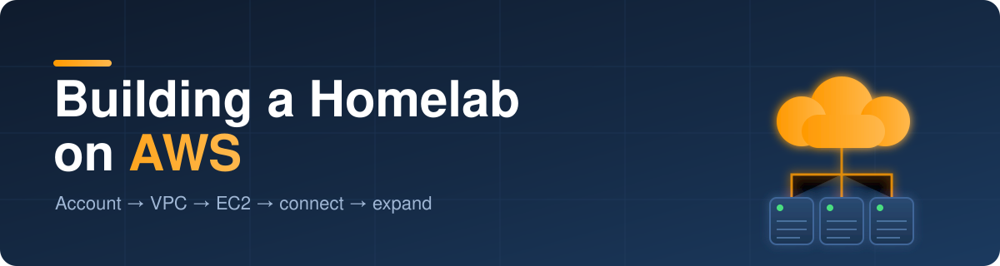

<p align="center">
  
</p>

# Building a Homelab on AWS

A start-to-finish guide: create an AWS account, build your own VPC, launch a free-tier
EC2 instance, and connect to it. By the end you have a running Linux box in the cloud
that is yours to experiment on, plus a menu of directions to grow it.

**Time required:** about an hour for a first run.
**Assumed knowledge:** basic command line. No AWS experience needed.

---

## Table of contents

1. [What you're building](#1-what-youre-building)
2. [Cost reality check](#2-cost-reality-check)
3. [Create and secure your AWS account](#3-create-and-secure-your-aws-account)
4. [Set a budget alarm before anything else](#4-set-a-budget-alarm-before-anything-else)
5. [Build the network: VPC, subnet, gateway, routes](#5-build-the-network-vpc-subnet-gateway-routes)
6. [Create a key pair](#6-create-a-key-pair)
7. [Create a security group](#7-create-a-security-group)
8. [Launch the EC2 instance](#8-launch-the-ec2-instance)
9. [Connect to your instance](#9-connect-to-your-instance)
10. [Where to go from here](#10-where-to-go-from-here)
11. [Harden the lab](#11-harden-the-lab)
12. [Shut it down and stop the billing](#12-shut-it-down-and-stop-the-billing)
13. [Troubleshooting](#13-troubleshooting)

---

## 1. What you're building

A single EC2 instance inside a VPC you build yourself. The VPC is your own isolated
network; the instance is a Linux server you reach over SSH from your laptop. That is the
whole starting point — deliberately small, so you understand every piece before you add
to it.

```
                    Your laptop
                         │
                         │  SSH (port 22)
                         │  source restricted to YOUR public IP
                         ▼
┌─────────────────────────────────────────────────────────────┐
│ AWS Region (us-east-1)                                      │
│                                                             │
│  ┌───────────────────────────────────────────────────────┐  │
│  │ VPC  homelab-vpc   10.10.0.0/16                       │  │
│  │                                                       │  │
│  │   Internet Gateway ──── Route table (0.0.0.0/0 → IGW) │  │
│  │            │                                          │  │
│  │  ┌─────────┴─────────────────────────────────────┐    │  │
│  │  │ Public subnet  10.10.1.0/24   (AZ: us-east-1a)│    │  │
│  │  │                                               │    │  │
│  │  │  ┌─────────────────────────────────────────┐  │    │  │
│  │  │  │ EC2  t3.micro  Amazon Linux 2023        │  │    │  │
│  │  │  │ Security group: inbound TCP 22 from     │  │    │  │
│  │  │  │ your IP only. Nothing else.             │  │    │  │
│  │  │  └─────────────────────────────────────────┘  │    │  │
│  │  └───────────────────────────────────────────────┘    │  │
│  └───────────────────────────────────────────────────────┘  │
└─────────────────────────────────────────────────────────────┘
```

The four network pieces (VPC, subnet, internet gateway, route table) plus the instance,
its key pair, and its security group are the fundamental building blocks of almost any
AWS deployment. Learn them here and everything larger is a variation on the same theme.

Section 10 lays out where to take it next once the box is up.

---

## 2. Cost reality check

**The AWS Free Tier changed on July 15, 2025.** Which model you get depends on when
your account was created, and older tutorials describe the old one.

| | Accounts created **on/after** July 15, 2025 | Accounts created **before** that date |
|---|---|---|
| Model | Credit-based **Free plan** | Legacy 12-month free tier |
| What you get | Up to **$200** in credits ($100 at sign-up, up to $100 more for completing activities) | **750 hours/month** of micro instances for 12 months |
| Duration | Free plan lasts **6 months**; all credits expire **12 months** after account creation | 12 months |
| Eligible EC2 types | `t3.micro`, `t3.small`, `t4g.micro`, `t4g.small`, `c7i-flex.large`, `m7i-flex.large` | `t2.micro` / `t3.micro` only |

Either way, this lab fits comfortably. 750 hours/month is more than one instance
running 24/7 (a month is ~730 hours), and under the credit model a `t3.micro` draws
only a few dollars of credit per month.

Also free in both models: **30 GB** of EBS storage and **100 GB/month** of data
transfer out.

### What actually generates surprise bills

These are the things that catch people, in rough order of how often:

- **A second instance left running.** The 750-hour allowance is cumulative across
  instances. Two instances running all month is 1,460 hours, so roughly half is billable.
- **Elastic IPs.** All public IPv4 addresses now carry an hourly charge (~$3.60/month
  each), including one attached to a running instance. It is small but it is not zero,
  and an *unattached* Elastic IP still bills.
- **EBS volumes after termination.** Terminating an instance does not always delete its
  volume. Orphaned volumes bill forever.
- **NAT Gateways.** Roughly $32/month plus data processing. This guide deliberately
  does not use one; a public subnet with an Internet Gateway is free.
- **Snapshots and AMIs** you created and forgot.

Set the budget alarm in section 4 before you launch anything, and follow section 12
when you are finished for the day.

> Instance types and free-tier terms change. Confirm current details at
> [aws.amazon.com/free](https://aws.amazon.com/free) and the
> [AWS Free Tier docs](https://docs.aws.amazon.com/cost-management/latest/userguide/what-is-free-tier.html).

---

## 3. Create and secure your AWS account

### 3.1 Sign up

1. Go to [aws.amazon.com](https://aws.amazon.com/) and choose **Create an AWS Account**.
2. Enter an email address and an account name. This email becomes your **root user**
   identity and cannot be reused across accounts.
3. Choose **Personal** account type and fill in your details.
4. Provide a credit or debit card. AWS places a small temporary authorisation (~$1)
   to validate it, then reverses it. A card is required even on the free plan.
5. Verify your phone number via SMS or voice call.
6. Choose a support plan: **Basic support — free**.
7. When prompted, choose the **Free plan** (not the paid plan) if you want a hard
   guardrail against spend. You can upgrade later, and unused credits carry over.

Account activation is usually a few minutes but can take a few hours. You will get a
confirmation email.

### 3.2 Lock down the root user

The root user can close the account, change billing, and bypass most restrictions. A
compromised root user on an AWS account is a genuinely expensive incident: the standard
attacker playbook is to spin up GPU fleets for crypto mining in every region.

Do these three things now.

1. **Enable MFA on root.** Sign in as root → click your account name (top right) →
   **Security credentials** → **Multi-factor authentication (MFA)** → **Assign MFA
   device**. Use an authenticator app (Google Authenticator, Authy, 1Password) or a
   hardware key. Save your recovery codes somewhere offline.
2. **Do not create access keys for root.** If any exist, delete them.
3. **Stop using root.** After the next step, sign in as root only for billing changes
   or account closure.

### 3.3 Create an admin user for daily work

AWS's current recommendation is IAM Identity Center, but for a single-person homelab a
plain IAM user is simpler and adequate.

1. Sign in as root → search for **IAM** → **Users** → **Create user**.
2. Username: `homelab-admin`. Tick **Provide user access to the AWS Management Console**.
3. Choose **I want to create an IAM user** → set a custom password → untick *Users must
   create a new password at next sign-in* if you set a strong one yourself.
4. **Next** → **Attach policies directly** → tick **AdministratorAccess**.

   > `AdministratorAccess` is broader than least privilege. It is a reasonable tradeoff
   > for a solo lab account with nothing of value in it, but never do this in an account
   > that matters.
5. Create the user. Copy the **console sign-in URL**
   (`https://<account-id>.signin.aws.amazon.com/console`) and bookmark it.
6. Sign out of root. Sign in as `homelab-admin`.
7. **Enable MFA on this user too**: IAM → Users → `homelab-admin` → **Security
   credentials** → **Assign MFA device**.

### 3.4 Optional: set up the AWS CLI

Every step in this guide includes both console clicks and CLI commands. The CLI is
faster and easier to get right. Skip this if you prefer clicking.

Install it by following
[the official instructions](https://docs.aws.amazon.com/cli/latest/userguide/getting-started-install.html),
then create an access key: IAM → Users → `homelab-admin` → **Security credentials** →
**Create access key** → **Command Line Interface (CLI)**.

```bash
aws configure
# AWS Access Key ID:     AKIA...
# AWS Secret Access Key: ...
# Default region name:   us-east-1
# Default output format: json

# Confirm it works
aws sts get-caller-identity
```

> Treat the secret access key like a password. Never commit it, never paste it into a
> chat or an issue. If it leaks, delete it in IAM immediately. Bots scrape public repos
> for these continuously.

---

## 4. Set a budget alarm before anything else

Do this before launching resources. It is the difference between a $3 surprise and a
$300 one.

**Console:** Sign in as `homelab-admin` → **Billing and Cost Management** → **Budgets**
→ **Create budget** → **Use a template** → **Monthly cost budget** → set the amount to
`5` USD → enter your email → **Create budget**.

> If Budgets says access is denied, sign in as root once and enable
> **Billing and Cost Management** → **Account** (or *Billing preferences*) →
> **IAM access to billing information**. IAM users are blocked from billing pages by
> default.

Also turn on **Free Tier usage alerts**: Billing and Cost Management → **Billing
preferences** → enable *Free tier usage alerts* with your email.

CLI equivalent:

```bash
ACCOUNT_ID=$(aws sts get-caller-identity --query Account --output text)
MY_EMAIL="you@example.com"

cat > /tmp/budget.json <<EOF
{
  "BudgetName": "homelab-monthly",
  "BudgetLimit": { "Amount": "5", "Unit": "USD" },
  "TimeUnit": "MONTHLY",
  "BudgetType": "COST"
}
EOF

cat > /tmp/notifications.json <<EOF
[
  {
    "Notification": {
      "NotificationType": "ACTUAL",
      "ComparisonOperator": "GREATER_THAN",
      "Threshold": 80,
      "ThresholdType": "PERCENTAGE"
    },
    "Subscribers": [
      { "SubscriptionType": "EMAIL", "Address": "${MY_EMAIL}" }
    ]
  }
]
EOF

aws budgets create-budget \
  --account-id "$ACCOUNT_ID" \
  --budget file:///tmp/budget.json \
  --notifications-with-subscribers file:///tmp/notifications.json
```

A budget alarm *notifies*, it does not *stop* spending. Section 12 is still your job.

---

## 5. Build the network: VPC, subnet, gateway, routes

Your account has a default VPC you could use, but building one yourself is the point of
the exercise. Four pieces are needed:

| Piece | Job |
|---|---|
| **VPC** | Private IP space, isolated from every other network |
| **Subnet** | A slice of that space pinned to one Availability Zone |
| **Internet Gateway** | The VPC's door to the internet |
| **Route table** | Tells the subnet to send non-local traffic to the IGW |

A subnet is only "public" because its route table points at an Internet Gateway. There
is no checkbox for it.

### Console path

1. **VPC** console → **Create VPC** → choose **VPC and more**. The wizard builds all
   four pieces correctly in one shot.
2. Name tag auto-generation: `homelab`
3. IPv4 CIDR: `10.10.0.0/16`
4. IPv6: **No IPv6 CIDR block**
5. Availability Zones: **1**
6. Public subnets: **1**. Private subnets: **0**.
7. **NAT gateways: None.** This matters — a NAT Gateway is ~$32/month and this lab
   does not need one.
8. VPC endpoints: **None**
9. DNS options: leave both **Enable DNS hostnames** and **Enable DNS resolution** ticked.
10. **Create VPC**.

### CLI path

```bash
REGION="us-east-1"
AZ="${REGION}a"

# 1. VPC
VPC_ID=$(aws ec2 create-vpc \
  --cidr-block 10.10.0.0/16 \
  --tag-specifications 'ResourceType=vpc,Tags=[{Key=Name,Value=homelab-vpc}]' \
  --query 'Vpc.VpcId' --output text --region "$REGION")
echo "VPC: $VPC_ID"

# DNS hostnames so the instance gets a resolvable public name
aws ec2 modify-vpc-attribute --vpc-id "$VPC_ID" --enable-dns-hostnames --region "$REGION"

# 2. Public subnet
SUBNET_ID=$(aws ec2 create-subnet \
  --vpc-id "$VPC_ID" \
  --cidr-block 10.10.1.0/24 \
  --availability-zone "$AZ" \
  --tag-specifications 'ResourceType=subnet,Tags=[{Key=Name,Value=homelab-public-1a}]' \
  --query 'Subnet.SubnetId' --output text --region "$REGION")
echo "Subnet: $SUBNET_ID"

# 3. Internet Gateway, attached to the VPC
IGW_ID=$(aws ec2 create-internet-gateway \
  --tag-specifications 'ResourceType=internet-gateway,Tags=[{Key=Name,Value=homelab-igw}]' \
  --query 'InternetGateway.InternetGatewayId' --output text --region "$REGION")
aws ec2 attach-internet-gateway --vpc-id "$VPC_ID" --internet-gateway-id "$IGW_ID" --region "$REGION"
echo "IGW: $IGW_ID"

# 4. Route table with a default route to the IGW, associated with the subnet
RTB_ID=$(aws ec2 create-route-table \
  --vpc-id "$VPC_ID" \
  --tag-specifications 'ResourceType=route-table,Tags=[{Key=Name,Value=homelab-public-rt}]' \
  --query 'RouteTable.RouteTableId' --output text --region "$REGION")
aws ec2 create-route \
  --route-table-id "$RTB_ID" \
  --destination-cidr-block 0.0.0.0/0 \
  --gateway-id "$IGW_ID" --region "$REGION"
aws ec2 associate-route-table \
  --route-table-id "$RTB_ID" --subnet-id "$SUBNET_ID" --region "$REGION"
echo "Route table: $RTB_ID"
```

Keep `$VPC_ID` and `$SUBNET_ID` handy. If you open a new terminal, re-fetch them:

```bash
VPC_ID=$(aws ec2 describe-vpcs --filters Name=tag:Name,Values=homelab-vpc \
  --query 'Vpcs[0].VpcId' --output text --region "$REGION")
SUBNET_ID=$(aws ec2 describe-subnets --filters Name=tag:Name,Values=homelab-public-1a \
  --query 'Subnets[0].SubnetId' --output text --region "$REGION")
```

---

## 6. Create a key pair

The key pair is how you authenticate over SSH. AWS holds the public key; you hold the
private key. **AWS cannot give you the private key again** — if you lose it, you lose
access to the instance.

### Console

**EC2** console → **Key Pairs** (under Network & Security) → **Create key pair**:

- Name: `homelab-key`
- Type: **ED25519** (shorter and faster than RSA; use RSA only if your client is ancient)
- Format: **.pem** for macOS/Linux/modern Windows OpenSSH, **.ppk** for PuTTY

The file downloads once. Then fix its permissions:

```bash
mkdir -p ~/.ssh
mv ~/Downloads/homelab-key.pem ~/.ssh/
chmod 400 ~/.ssh/homelab-key.pem
```

### CLI

```bash
aws ec2 create-key-pair \
  --key-name homelab-key \
  --key-type ed25519 \
  --query 'KeyMaterial' --output text \
  --region "$REGION" > ~/.ssh/homelab-key.pem

chmod 400 ~/.ssh/homelab-key.pem
```

`chmod 400` is not optional. OpenSSH refuses to use a private key that other users on
your machine can read, with `UNPROTECTED PRIVATE KEY FILE`.

**Windows PowerShell** equivalent of `chmod 400`:

```powershell
icacls "$env:USERPROFILE\.ssh\homelab-key.pem" /inheritance:r
icacls "$env:USERPROFILE\.ssh\homelab-key.pem" /grant:r "$($env:USERNAME):(R)"
```

---

## 7. Create a security group

A security group is a stateful allowlist attached to the instance's network interface.
Stateful means reply traffic is automatically permitted, so you only ever write inbound
rules for connections you want *initiated* from outside.

**One inbound rule: SSH from your IP only.** That is the entire ruleset to start with.

First, find your public IP:

```bash
MY_IP=$(curl -s https://checkip.amazonaws.com)
echo "$MY_IP"
```

### Console

EC2 → **Security Groups** → **Create security group**:

- Name: `homelab-sg`
- Description: `SSH from home IP only`
- VPC: select `homelab-vpc`
- **Inbound rules** → **Add rule**:
  - Type: **SSH**, Protocol: TCP, Port: 22
  - Source: **My IP** (the console fills in your current address)
  - Description: `SSH from home`
- **Outbound rules**: leave the default *All traffic to 0.0.0.0/0*. The instance needs
  this to fetch OS updates and download software.
- **Create security group**

### CLI

```bash
SG_ID=$(aws ec2 create-security-group \
  --group-name homelab-sg \
  --description "SSH from home IP only" \
  --vpc-id "$VPC_ID" \
  --tag-specifications 'ResourceType=security-group,Tags=[{Key=Name,Value=homelab-sg}]' \
  --query 'GroupId' --output text --region "$REGION")

aws ec2 authorize-security-group-ingress \
  --group-id "$SG_ID" \
  --protocol tcp --port 22 \
  --cidr "${MY_IP}/32" \
  --region "$REGION"

echo "SG: $SG_ID"
```

### Keep the default deny-all posture

A security group denies everything not explicitly allowed. Resist the urge to open
extra ports "just in case":

| Rule | Why to avoid |
|---|---|
| `22` from `0.0.0.0/0` | Credential-stuffing bots hit exposed SSH within minutes |
| `-1` (all traffic) from `0.0.0.0/0` | Opens the whole instance to the internet |

When you later run a service on the instance (a web app, a dashboard), the safest way to
reach it is an SSH tunnel — see section 10 — rather than opening its port to the world.

### When your home IP changes

Your ISP will rotate it and SSH will hang. Update the rule rather than widening it:

```bash
OLD_IP="203.0.113.4"          # the address currently in the rule
NEW_IP=$(curl -s https://checkip.amazonaws.com)

aws ec2 revoke-security-group-ingress \
  --group-id "$SG_ID" --protocol tcp --port 22 \
  --cidr "${OLD_IP}/32" --region "$REGION"

aws ec2 authorize-security-group-ingress \
  --group-id "$SG_ID" --protocol tcp --port 22 \
  --cidr "${NEW_IP}/32" --region "$REGION"
```

Tired of this? Section 11 covers SSM Session Manager, which needs no inbound rule at all.

---

## 8. Launch the EC2 instance

### Choosing a size

| Type | vCPU | RAM | Verdict |
|---|---|---|---|
| `t3.micro` | 2 | 1 GB | Free-tier safe. Fine for a first box and light services. |
| `t3.small` | 2 | 2 GB | More headroom. Free-plan eligible; **not** in the legacy 12-month tier. |

Start with `t3.micro`. You can resize later: stop the instance → **Actions → Instance
settings → Change instance type** → start.

> `t3.*` is x86; `t4g.*` is ARM/Graviton and also free-tier eligible. Either works —
> stick with `t3.micro` unless you specifically want to try ARM, since a few pieces of
> software still ship x86-only binaries.

### Console

EC2 → **Instances** → **Launch instances**:

1. **Name:** `homelab-01`
2. **AMI:** *Amazon Linux 2023 AMI* — confirm it says **Free tier eligible**
3. **Architecture:** 64-bit (x86)
4. **Instance type:** `t3.micro`
5. **Key pair:** `homelab-key`
6. **Network settings** → **Edit**:
   - VPC: `homelab-vpc`
   - Subnet: `homelab-public-1a`
   - **Auto-assign public IP: Enable** (without this you cannot reach it)
   - Firewall: **Select existing security group** → `homelab-sg`
7. **Configure storage:** 20 GiB, **gp3**, and tick **Encrypted**. Free tier covers
   30 GB total, so stay under that across all volumes.
8. **Advanced details** → find **Metadata version** and set
   **V2 only (token required)**. Leave *Metadata response hop limit* at 1.

   This is a good default habit. The instance metadata service at `169.254.169.254`
   hands out the instance's IAM credentials. IMDSv1 answers any plain HTTP GET, so a
   server-side request forgery bug in something you run could read those credentials.
   IMDSv2 requires a token first, which SSRF generally cannot obtain.
9. **Launch instance**

### CLI

```bash
# Latest Amazon Linux 2023 AMI, resolved from the SSM public parameter so it is
# always current rather than a hardcoded ID that goes stale
AMI_ID=$(aws ssm get-parameters \
  --names /aws/service/ami-amazon-linux-latest/al2023-ami-kernel-default-x86_64 \
  --query 'Parameters[0].Value' --output text --region "$REGION")
echo "AMI: $AMI_ID"

INSTANCE_ID=$(aws ec2 run-instances \
  --image-id "$AMI_ID" \
  --instance-type t3.micro \
  --key-name homelab-key \
  --subnet-id "$SUBNET_ID" \
  --security-group-ids "$SG_ID" \
  --associate-public-ip-address \
  --metadata-options "HttpEndpoint=enabled,HttpTokens=required,HttpPutResponseHopLimit=1" \
  --block-device-mappings '[{"DeviceName":"/dev/xvda","Ebs":{"VolumeSize":20,"VolumeType":"gp3","Encrypted":true,"DeleteOnTermination":true}}]' \
  --tag-specifications 'ResourceType=instance,Tags=[{Key=Name,Value=homelab-01}]' \
  --query 'Instances[0].InstanceId' --output text --region "$REGION")

echo "Instance: $INSTANCE_ID"

# Wait until it is running, then print the public IP
aws ec2 wait instance-running --instance-ids "$INSTANCE_ID" --region "$REGION"

PUBLIC_IP=$(aws ec2 describe-instances \
  --instance-ids "$INSTANCE_ID" \
  --query 'Reservations[0].Instances[0].PublicIpAddress' \
  --output text --region "$REGION")

echo "Public IP: $PUBLIC_IP"
```

`DeleteOnTermination: true` is what stops an orphaned EBS volume billing you after you
terminate the instance.

---

## 9. Connect to your instance

The default user on Amazon Linux 2023 is `ec2-user`.

```bash
ssh -i ~/.ssh/homelab-key.pem ec2-user@"$PUBLIC_IP"
```

On first connect you will see:

```
The authenticity of host '...' can't be established.
ED25519 key fingerprint is SHA256:...
Are you sure you want to continue connecting (yes/no/[fingerprint])?
```

Type `yes`. To verify the fingerprint properly rather than trusting on first use,
compare it against the console output: EC2 → select instance → **Actions** →
**Monitor and troubleshoot** → **Get system log**, and look for the host key block.

Once you are in, patch the box:

```bash
sudo dnf update -y
```

### An SSH config shortcut

```bash
cat >> ~/.ssh/config <<EOF

Host homelab
    HostName ${PUBLIC_IP}
    User ec2-user
    IdentityFile ~/.ssh/homelab-key.pem
    IdentitiesOnly yes
EOF
```

Now it is just `ssh homelab`. Note that the public IP changes every time you stop and
start the instance, so update `HostName` after a restart (or attach an Elastic IP,
accepting the ~$3.60/month).

### If it hangs

A hang, rather than a refusal, almost always means the security group or your IP.
Section 13 has the full checklist.

### Alternative: browser and agent-based access

- **EC2 Instance Connect** — EC2 console → select instance → **Connect** → *EC2
  Instance Connect*. Browser shell, no local key needed. Still requires inbound 22, but
  from [AWS's published IP range](https://docs.aws.amazon.com/AWSEC2/latest/UserGuide/connect-using-eice.html)
  for your region rather than your laptop.
- **SSM Session Manager** — no inbound rules at all. See section 11.2.

You now have a working cloud Linux box. Everything below is optional.

---

## 10. Where to go from here

The instance is a blank Linux server. Here are directions to grow the lab, roughly from
simplest to most involved. Each is a signpost, not a full walkthrough — pick whatever
matches what you want to learn.

### Run services on the instance

- **Install a web server** (`nginx`, `caddy`) or a runtime (`python3`, `node`, `go`) and
  host something you wrote.
- **Install Docker** to run self-hosted apps in containers without polluting the host:

  ```bash
  sudo dnf install -y docker
  sudo systemctl enable --now docker
  sudo usermod -aG docker ec2-user   # then log out and back in
  ```

  From there you can run things like a personal dashboard, a Git server (Gitea), a
  wiki, monitoring (Grafana/Prometheus), or a media/notes app — anything with a
  published container image.

### Reach a service without opening ports

When you run something that listens on, say, port 3000, do **not** open 3000 in the
security group. Instead forward it over the SSH connection you already have. Run this
from your laptop:

```bash
ssh -N -L 3000:localhost:3000 homelab
```

Then browse to `http://localhost:3000`. The traffic rides inside the encrypted SSH
session, so the service stays private and there is still only one open port (22). Add
more `-L` flags for more services.

### Turn it into a cybersecurity lab

The same box makes a solid security-practice environment: run intentionally vulnerable
apps in Docker and attack them from tooling on the instance. The one rule is to **keep
the vulnerable apps off the internet** — bind them to loopback and reach them over the
SSH tunnel above, never by opening their ports in the security group. A deliberately
weak app exposed publicly is found and compromised by scanners within hours.

Short example — OWASP Juice Shop as a target, bound to localhost only:

```bash
# On the instance (Docker installed as above). The 127.0.0.1: prefix is the
# control: it stops Docker from publishing the port to the internet.
docker run -d --name juiceshop -p 127.0.0.1:3000:3000 bkimminich/juice-shop
```

```bash
# From your laptop: tunnel it in, then browse to http://localhost:3000
ssh -N -L 3000:localhost:3000 homelab
```

Add attacker tooling in its own container and point it only at your own target:

```bash
# On the instance
docker run -dit --name kali --network host kalilinux/kali-rolling /bin/bash
docker exec -it kali /bin/bash
# inside: apt update && apt install -y nmap nikto sqlmap
nikto -h http://localhost:3000
```

From there you can add more targets (DVWA, WebGoat), a scoreboard of challenges, and
write-ups of each finding. Only ever attack targets you own on this instance — scanning
systems you do not control is illegal, and AWS has its own
[penetration testing rules](https://aws.amazon.com/security/penetration-testing/) that
forbid pointing tools at AWS infrastructure. Treat the instance as expendable and keep
nothing sensitive on it.

### Explore other AWS building blocks

- **S3** — object storage for backups, static files, or a static website.
- **RDS** — a managed database instead of running one on the instance (watch free-tier
  limits).
- **Elastic IP + Route 53** — a stable address and a real domain name for your box.
- **CloudWatch** — dashboards, metrics, and alarms for the instance.
- **A private subnet + NAT** — practise the public/private tier split (remember the NAT
  Gateway cost, or use a NAT instance to stay cheap).
- **A second instance** — start building multi-host setups, but mind the 750-hour total.

### Practise infrastructure as code

You built everything by hand to understand it. The natural next step is to rebuild it as
code so it is repeatable and disposable:

- **Terraform** or **OpenTofu** — the community-standard AWS modules
  (`terraform-aws-modules/vpc`, `.../eks`, and others) turn this whole guide into a few
  dozen lines you can `apply` and `destroy` on demand.
- **CloudFormation** or **AWS CDK** — AWS-native equivalents.

Defining the lab as code also makes teardown trivial: one `destroy` removes everything,
which sidesteps most of the surprise-bill traps in section 2.

### Automate the host

- **cloud-init / user data** — have the instance install and configure software
  automatically at first boot.
- **Ansible** — manage the box's configuration from your laptop.

Whatever you add, keep sections 11 (harden) and 12 (shut down) in mind so the lab stays
cheap and safe.

---

## 11. Harden the lab

Sensible defaults for a box that is reachable from the internet. Worth doing once you
are past the first session.

### 11.1 Keep the host patched

```bash
sudo dnf update -y
# Optional: automatic security patches
sudo dnf install -y dnf-automatic
sudo systemctl enable --now dnf-automatic.timer
```

### 11.2 Replace SSH with SSM Session Manager

This removes the need for **any** inbound rule — no port 22, no IP allowlist to keep
updating. Session Manager connects outbound through the SSM agent (already installed on
Amazon Linux 2023).

1. Create an IAM role for the instance:

   ```bash
   cat > /tmp/ec2-trust.json <<'EOF'
   {
     "Version": "2012-10-17",
     "Statement": [{
       "Effect": "Allow",
       "Principal": { "Service": "ec2.amazonaws.com" },
       "Action": "sts:AssumeRole"
     }]
   }
   EOF

   aws iam create-role --role-name homelab-ssm-role \
     --assume-role-policy-document file:///tmp/ec2-trust.json

   aws iam attach-role-policy --role-name homelab-ssm-role \
     --policy-arn arn:aws:iam::aws:policy/AmazonSSMManagedInstanceCore

   aws iam create-instance-profile --instance-profile-name homelab-ssm-profile
   aws iam add-role-to-instance-profile \
     --instance-profile-name homelab-ssm-profile --role-name homelab-ssm-role
   ```

2. Attach it: EC2 → select instance → **Actions → Security → Modify IAM role** →
   choose `homelab-ssm-profile`.

3. Connect with no open port:

   ```bash
   aws ssm start-session --target "$INSTANCE_ID" --region "$REGION"
   ```

4. Once that works, delete the inbound SSH rule entirely:

   ```bash
   aws ec2 revoke-security-group-ingress \
     --group-id "$SG_ID" --protocol tcp --port 22 \
     --cidr "$(curl -s https://checkip.amazonaws.com)/32" --region "$REGION"
   ```

   You can still tunnel service ports over SSM with `aws ssm start-session` and the
   `AWS-StartPortForwardingSession` document, so the section 10 tunnelling workflow
   still works without SSH.

### 11.3 Stop the instance when idle

The cheapest hardening is a powered-off box. Stopping the instance (section 12.1) costs
nothing for compute and removes the attack surface entirely between sessions.

### 11.4 Keep the blast radius small

- One purpose per account: nothing of value beyond the lab lives here.
- No real credentials, keys, or personal data on the instance.
- Attach only the IAM permissions a task actually needs. A broad instance role plus an
  internet-facing box is how a small mistake becomes an account-wide one.

---

## 12. Shut it down and stop the billing

Two levels: **stop** between sessions, **destroy** when you are done for good.

### 12.1 Between sessions — stop (cheap)

A stopped instance bills nothing for compute; you pay only for the 20 GB EBS volume
(~$1.60/month, inside the free-tier storage allowance).

```bash
aws ec2 stop-instances --instance-ids "$INSTANCE_ID" --region "$REGION"
```

The public IP is released on stop and a new one is assigned on start, so update your
`~/.ssh/config` `HostName` afterward. Restart with:

```bash
aws ec2 start-instances --instance-ids "$INSTANCE_ID" --region "$REGION"
```

### 12.2 Done for good — destroy everything

Delete in dependency order. Terminating the instance also deletes its volume because you
set `DeleteOnTermination: true`.

```bash
# 1. Terminate the instance
aws ec2 terminate-instances --instance-ids "$INSTANCE_ID" --region "$REGION"
aws ec2 wait instance-terminated --instance-ids "$INSTANCE_ID" --region "$REGION"

# 2. Security group
aws ec2 delete-security-group --group-id "$SG_ID" --region "$REGION"

# 3. Detach and delete the internet gateway
IGW_ID=$(aws ec2 describe-internet-gateways \
  --filters Name=attachment.vpc-id,Values=$VPC_ID \
  --query 'InternetGateways[0].InternetGatewayId' --output text --region "$REGION")
aws ec2 detach-internet-gateway --internet-gateway-id "$IGW_ID" --vpc-id "$VPC_ID" --region "$REGION"
aws ec2 delete-internet-gateway --internet-gateway-id "$IGW_ID" --region "$REGION"

# 4. Subnet
aws ec2 delete-subnet --subnet-id "$SUBNET_ID" --region "$REGION"

# 5. Custom route table (find the non-main one for this VPC)
RTB_ID=$(aws ec2 describe-route-tables \
  --filters Name=vpc-id,Values=$VPC_ID Name=association.main,Values=false \
  --query 'RouteTables[0].RouteTableId' --output text --region "$REGION")
[ "$RTB_ID" != "None" ] && aws ec2 delete-route-table --route-table-id "$RTB_ID" --region "$REGION"

# 6. VPC
aws ec2 delete-vpc --vpc-id "$VPC_ID" --region "$REGION"
```

### 12.3 Confirm you are at zero

- **EC2 → Instances** — none running.
- **EC2 → Elastic Block Store → Volumes** — none `available` or `in-use`. Orphaned
  volumes are the most common lingering charge.
- **EC2 → Elastic IPs** — none allocated. An unattached EIP bills.
- **EC2 → Snapshots** and **AMIs** — nothing you created remains.
- **VPC console** — your `homelab-vpc` is gone.
- **Billing → Free Tier** — usage is tracking where you expect.

The key pair itself costs nothing; leave it or delete it under EC2 → Key Pairs.

---

## 13. Troubleshooting

### SSH hangs / times out

Almost always the network path. Check in this order:

1. **Your IP changed.** `curl -s https://checkip.amazonaws.com`, compare to the SG rule,
   update it (section 7).
2. **Public IP missing.** `aws ec2 describe-instances --instance-ids "$INSTANCE_ID"
   --query 'Reservations[0].Instances[0].PublicIpAddress'`. If `None`, the subnet was
   not set to auto-assign — the simplest fix is to relaunch with the section 8 settings.
3. **No route to the IGW.** Confirm the subnet's route table has `0.0.0.0/0 → igw-...`.
4. **Wrong username.** Amazon Linux is `ec2-user`, not `root`, `admin`, or `ubuntu`.

### `Permission denied (publickey)`

- Wrong key: the `-i` file must match the key pair chosen at launch.
- Wrong user (see above).
- Add `-v` for verbose output: `ssh -v -i ~/.ssh/homelab-key.pem ec2-user@$PUBLIC_IP`.

### `UNPROTECTED PRIVATE KEY FILE`

`chmod 400 ~/.ssh/homelab-key.pem` (Windows: section 6).

### An unexpected charge appeared

**Billing → Bills**, expand by service to see the source. Usual suspects: a second
running instance, an unattached Elastic IP, or an orphaned EBS volume. Work through the
section 12.3 checklist.

---

## Quick reference

```bash
# Connect
ssh homelab

# Forward a service running on the instance (from your laptop)
ssh -N -L 3000:localhost:3000 homelab

# Stop / start billing between sessions
aws ec2 stop-instances  --instance-ids "$INSTANCE_ID" --region "$REGION"
aws ec2 start-instances --instance-ids "$INSTANCE_ID" --region "$REGION"

# Update the SSH rule after your home IP changes
NEW_IP=$(curl -s https://checkip.amazonaws.com)
aws ec2 authorize-security-group-ingress \
  --group-id "$SG_ID" --protocol tcp --port 22 --cidr "${NEW_IP}/32" --region "$REGION"
```
